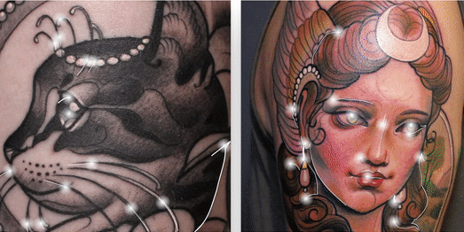

# Malimalia 
## Description 
Freelance project of the site for tattoo artist Malimalia. Responsive design. Exact replica of the original site from wix.com. Added interesting dynamic animated galleries. Button animation. Easy update thru json.

## Table of Contents
* [Installation and Usage](#installation)
* [License](#license)
* [Questions](#questions)
* [Review](#review)
## Installation and Usage
Simply clone the repo, and/or visit the deployed page link to begin.

### Logo animation using SVG and Greensock
 

### Decoration of the featured pictures using SVG
 

## Contributing 
 None 
## License 
 Licensed under MIT License. 
## Tests 
 None
## Questions 
 You can see more of my Projects on my [GitHub profile](https://github.com/sbolotnikov) 
 Contact me with any questions or suggestions!
 * Sergey Bolotnikov [sbolotnikov](mailto:sbolotnikov@gmail.com)
## Review 
  * Here is this repo link: https://github.com/sbolotnikov/mashasite
 
  * Link: [Malimalia](https://sbolotnikov.github.io/mashasite/)